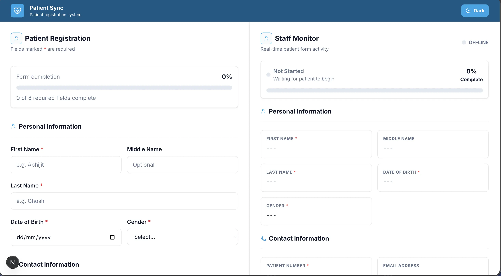
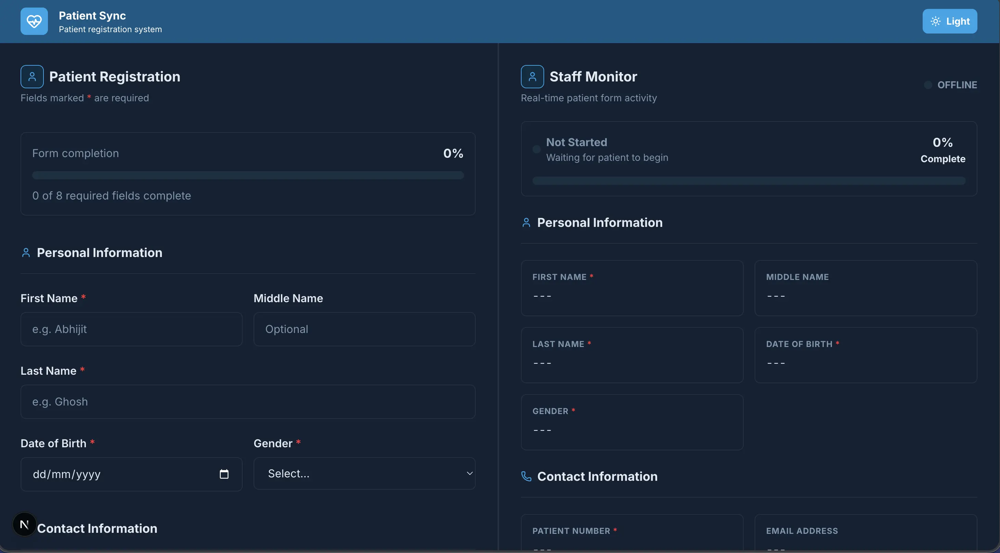
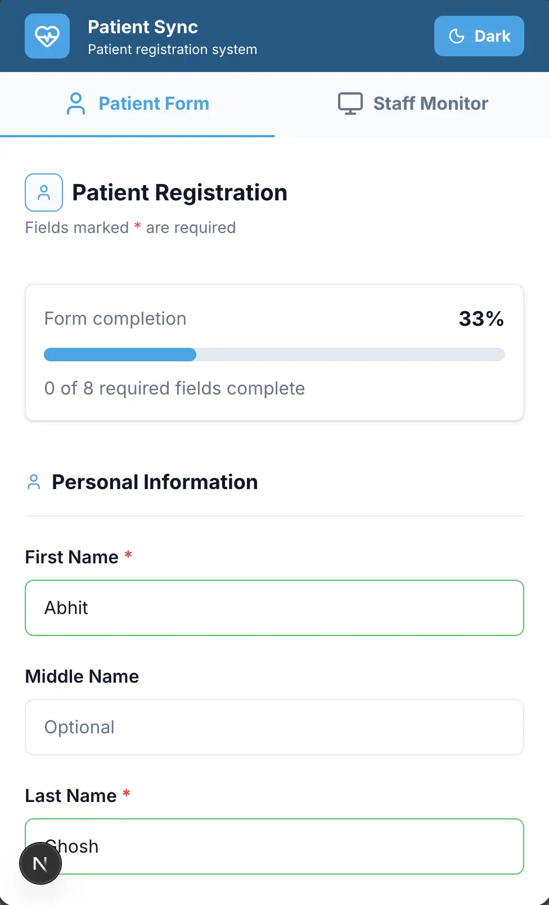
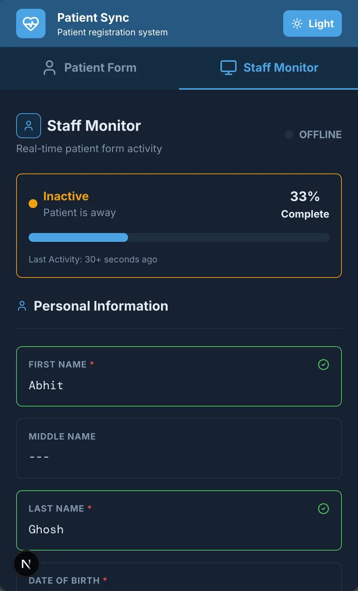
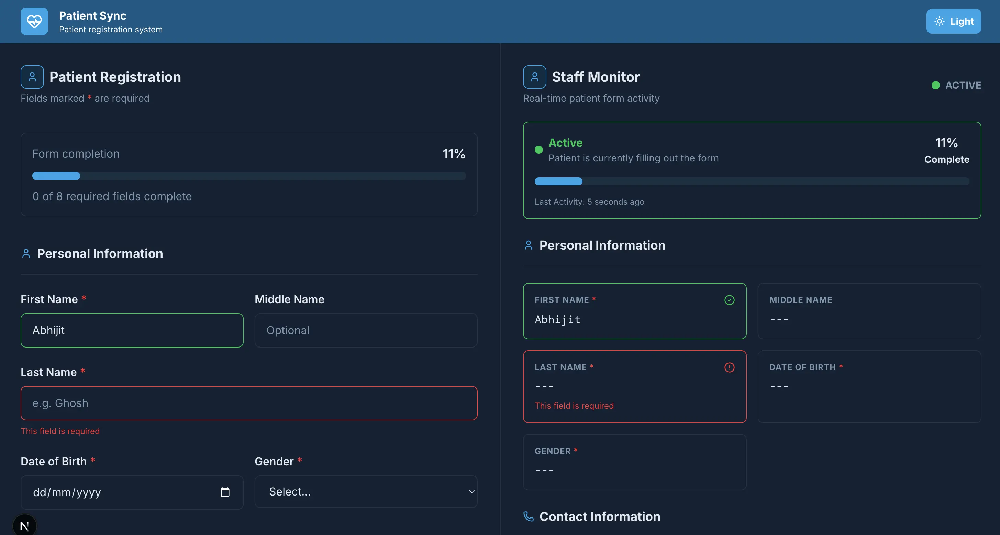
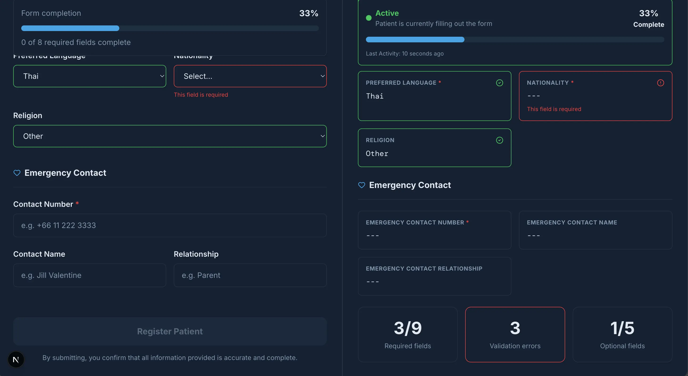
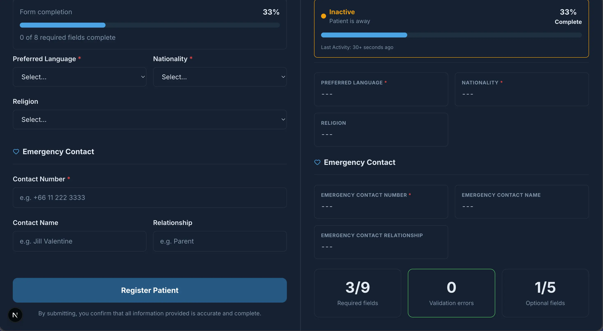

# 🏥 Patient Sync

A real-time patient registration dashboard built with **Next.js**, **React**, **Tailwind CSS**, and **WebSockets**.

Patient Sync simulates a digital hospital registration system where a patient fills out a registration form while staff members monitor the process live in real time. Every interaction—from typing into a field to completing the registration—is synchronized instantly across both dashboards.

---

## 🌐 Live Demo

**Vercel:** https://patient-sync-jh74xh4sh-abhi-ghoshs-projects.vercel.app

---

## ✨ Features

- 🔄 Real-time synchronization using WebSockets
- 🩺 Live Staff Monitor dashboard
- 📝 Patient registration form
- ✅ Real-time form validation
- 📊 Live completion percentage
- 🎯 Active field tracking
- ⚠️ Validation error monitoring
- 📱 Fully responsive layout
- 🌙 Dark / Light mode
- 📡 Live activity status (Active / Inactive / Submitted)
- 🎉 Registration success screen
- 📈 Live statistics dashboard

---

# 📸 Screenshots

## Desktop (Light)



---

## Desktop (Dark)



---

## Mobile (Light)



---

## Mobile (Dark)



---

## Real-time Activity Tracking



---

## Staff Monitoring



---

## Live Statistics



---

# 🛠️ Technologies Used

### Frontend

- Next.js 16
- React 19
- JavaScript (ES6+)
- Tailwind CSS
- Lucide React

### Real-time Communication

- WebSockets (Native Browser API)
- Node.js WebSocket Server

### Development Tools

- Git
- GitHub
- Vercel
- VS Code

---

# 🚀 Getting Started

## 1. Clone the repository

```bash
git clone https://github.com/abhi-ghosh/patient-sync.git
```

---

## 2. Navigate into the project

```bash
cd patient-sync
```

---

## 3. Install dependencies

```bash
npm install
```

---

## 4. Start the Next.js development server

```bash
npm run dev
```

The application will be available at:

```
http://localhost:3000
```

---

# 🔌 Running the WebSocket Server

This project requires a WebSocket server for real-time synchronization.

Open a **second terminal**.

Navigate to the server directory (or wherever your websocket server is located).

Then run:

```bash
node server.js
```

The server should start on:

```
ws://localhost:8080
```

Once both the Next.js application and WebSocket server are running, open two browser windows to experience real-time synchronization.

---

# 💻 Project Structure

```
patient-sync
│
├── app/
├── components/
├── assets/
├── public/
├── package.json
└── README.md
```

---

# 🎯 How It Works

1. The patient begins filling out the registration form.
2. Every input is validated in real time.
3. Field updates are immediately sent through WebSockets.
4. The Staff Monitor receives live updates including:
   - Current active field
   - Form progress
   - Validation errors
   - Patient activity status
5. Once submitted, both dashboards transition into a completed state.

---

# 📚 What I Learned

This project helped reinforce my understanding of:

- React state management
- Component architecture
- Form validation
- Conditional rendering
- Reusable UI components
- WebSocket communication
- Responsive design
- Real-time application development

---

# 📄 License

This project is open source and available under the MIT License.

---

## 👨‍💻 Author

**Abhijit Ghosh**
